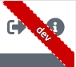

# Ribbon
Il s'agit du petit ruban en haut à droite de la fenêtre qui indique sur quel environnement nous nous trouvons
(hors production et pré-production).



Pour l'inclure, il suffit d'ajouter dans le fichier `app.component.html` la ligne :
```
<symphonie-ribbon [env]="..."></symphonie-ribbon>
```
Il prend en entrée la variable `env` qui correspond à l'environnement sur lequel on se trouve, retrouvable dans l'objet
[ConfigurationJson](configuration.md#ConfigurationJson) fournie par la lib.

_(Note : ne souhaitant rendre visible ce ruban uniquement hors production et pré-production, il est recommandé d'ajouter
l'attribut `*ngIf` avec comme valeur un booleen pour vérifier si `env === production || env === preproduction`)_
